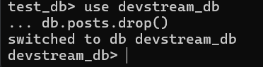
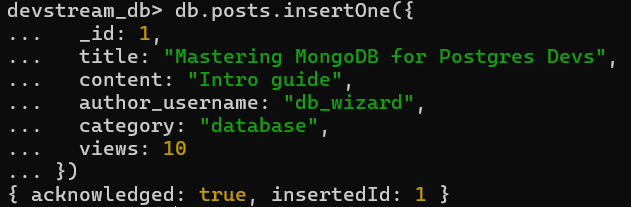
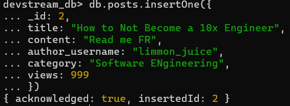
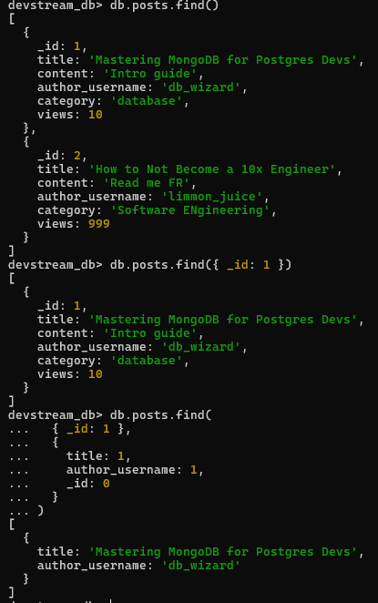
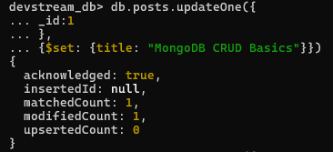
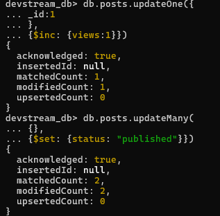
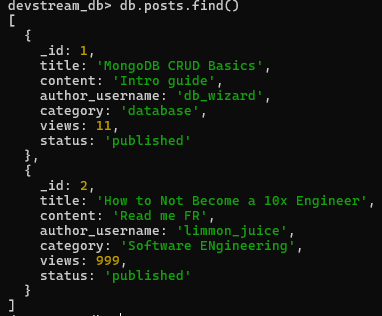
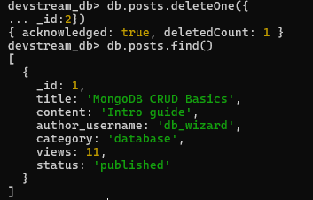

# Activity 10 Solution


## Part 1: Quick Mapping (Postgres -> MongoDB)

| PostgreSQL | MongoDB Equivalent |
|---|---|
| `INSERT INTO posts ...` |`db.posts.insertOne({title:"...",author:"...", ...}) `|
| `SELECT * FROM posts WHERE title='...'` |`db.posts.find({ title: "..." })`|
| `UPDATE posts SET title='...' WHERE id=...`|`db.posts.updateOne({_id:...},{$set: {title:"..."}})`  |
| `DELETE FROM posts WHERE id=...` |`db.posts.deleteOne({ _id: ... })`  |

## Part 2: Hands-on CRUD in MongoDB

Write the commands you executed and paste screenshots from Mongo shell after each command/block.

### 2.1 Setup

Commands:

```javascript
use devstream_db
db.posts.drop()

db.posts.insertOne({
  _id: 1,
  title: "Mastering MongoDB for Postgres Devs",
  content: "Intro guide",
  author_username: "db_wizard",
  category: "database",
  views: 10
})
```

Screenshot(s):



### 2.2 Create

Commands:

```javascript
db.posts.insertOne({
_id: 2,
title: "How to Not Become a 10x Engineer",
content: "Read me FR",
author_username: "limmon_juice",
category: "Software ENgineering",
views: 999
})
```

Screenshot(s):


### 2.3 Read

Commands:

```javascript
db.posts.find()

db.posts.find({_id:1})

db.posts.find(
{ _id: 1 },
{
  title: 1,
  author_username: 1,
  _id: 0
}
)
```

Screenshot(s):


### 2.4 Update

Commands:

```javascript
 db.posts.updateOne({
_id:1
},
{$set: {title: "MongoDB CRUD Basics"}})

db.posts.updateOne({
_id:1
},
{$inc: {views:1}})

db.posts.updateMany(
{},
{$set: {status: "published"}})
```

Screenshot(s):




### 2.5 Delete

Commands:

```javascript
db.posts.deleteOne({
_id:2})
```

Screenshot(s):


## Part 3: Reflection (3-4 sentences)

1. One thing that feels easier in MongoDB CRUD:

 One thing that feels easier for me in MongoDB CRUD is how the data is structured like a JSON object, which honestly makes it feel more intuitive as a programmer. Instead of thinking in rows and columns, I can just treat data like objects, similar to how I already work in code. That means less mental switching, and everything just flows more naturally when creating or updating data. It almost feels like I’m just manipulating regular variables rather than dealing with a database system.

2. One thing that was clearer in PostgreSQL CRUD:

On the other hand, one thing that feels clearer in PostgreSQL CRUD is its SQL syntax, since it reads almost like plain English. Commands like SELECT, INSERT, and WHERE make the intent of the query very obvious, even at a glance. When things get more complex, the structure still holds up, which makes it easier to debug or explain to someone else. In a way, it feels more formal—but that formality actually helps keep everything organized and understandable.