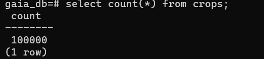
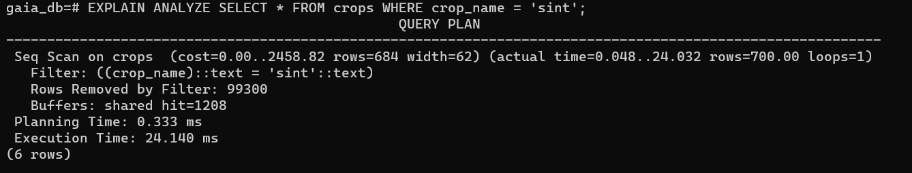
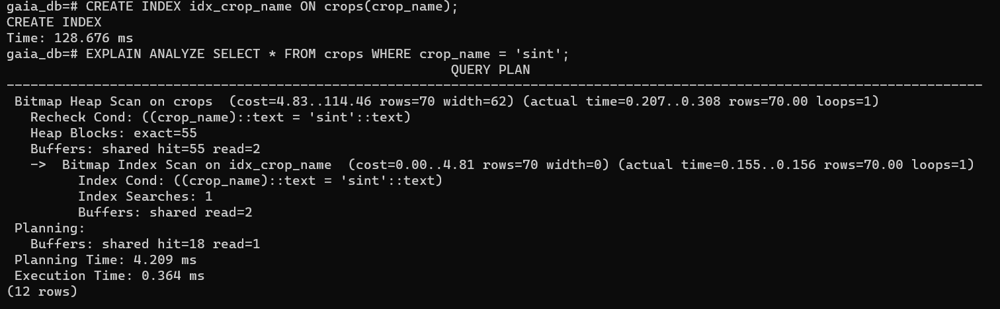

# 1
Initial Data Insertion Time (100,000 rows): 6m 10s 70ms  
Query Execution Time (Non-Indexed): 24.140 ms  
Query Execution Time (Indexed): 1.538 ms  
Single Row Insertion Time (With Index): 33.066 ms  
Answer the following questions:  

# 2
How did the query execution time change after creating the index? Was it faster or slower? By approximately how much?
After creating the index, the query became noticeably faster. The execution time decreased from 24.140 ms (non-indexed) to 1.538 ms (indexed). That’s an improvement of about 22.602 ms, which means the query ran roughly 15–16 times faster with the index. Even though milliseconds seem small, in large systems with many users or repeated queries, this performance gain is very significant.

Why do you think the query performance changed as you observed?
I think the performance improved because the database no longer needed to scan rows one by one or do a full table scan. Without an index, the database performs a sequential scan, checking many rows until it finds the correct data. After creating the index, the system used the index structure like a shortcut to directly locate the needed rows. This reduced the number of operations required, which explains why the query execution time became much shorter.

What is the trade-off of having an index on a table? (Hint: Compare the initial bulk insertion time with the single row insertion time after the index was created).
From my observation, the main trade-off is slower insertion performance once an index is present. During the initial bulk insertion of 100,000 rows, each insert only took around 1.1–1.3 ms because the database was simply writing data to the table. After the index was created, however, inserting even a single row took 33.066 ms. This happened because the database now had to update both the table and the index structure at the same time. This shows that indexes significantly improve data retrieval speed, but introduce extra overhead during write operations like insert, update, and delete, making write speeds slower.

# 3
# Row Count Verification

# Non-Indexed Query

# Indexed Query
